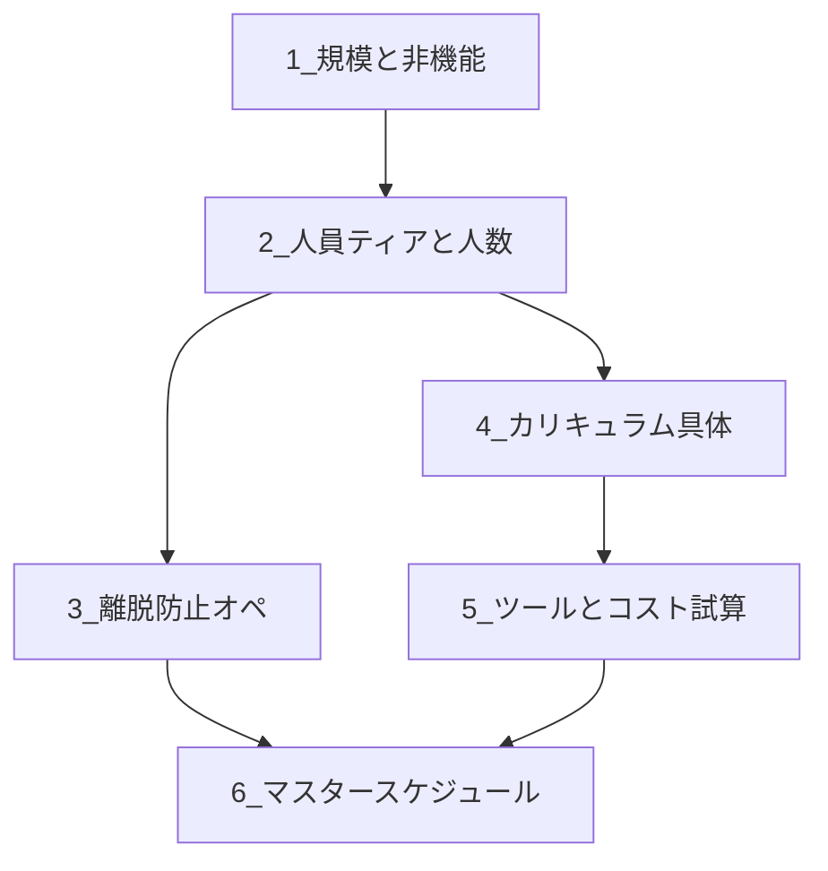

# 育成・開催を止めている論点の整理と突破順

**いまの感覚**: カリキュラムの**方針**はあるが**中身が詰まりきっていない**、**ツールコストが読めない**、**離脱を減らすオペが定まらない**、**必要人員が読めない**、その結果**スケジュールが組めない**。

これらは**同時に全部決めようとすると固まる**ので、**依存関係に沿って一つずつ**進める。下の順は「後ろの項目が前の決定を使う」順。

---

## 論点マップ（何が何をブロックするか）

| # | 論点 | 決めると手に入るもの | 既存の参照 |
|---|------|----------------------|------------|
| **1** | **規模と非機能**（募集上限・ハイブリッド・無料/実費方針） | 「何人を守るか」「会場/Zoomの前提」 | [`ORG_ROLLOUT_FLOW.md`](ORG_ROLLOUT_FLOW.md)、[`sponsor_b2b_package.md`](sponsor_b2b_package.md) |
| **2** | **人員**（T0/T1/T2・何名・誰がコア） | OHの回数・班の数・メンター研修の対象人数 | [`MENTOR_ONBOARDING.md`](MENTOR_ONBOARDING.md) |
| **3** | **離脱防止オペ**（タッチポイント・班・チケット・リマインド） | 「週に何回・誰が・何をするか」の一覧 | [`mentor_ops_handbook.md`](mentor_ops_handbook.md)、[`student_ops_sheet_spec.md`](../operations/student_ops_sheet_spec.md) |
| **4** | **カリキュラム具体**（各Dayの90分の中身・課題） | 受講生・メンター・外注への依頼の粒度 | [`CURRICULUM_VENDOR_BRIEF.md`](vendor/CURRICULUM_VENDOR_BRIEF.md)、[`IDEATION_AND_SCOPE_LADDER.md`](IDEATION_AND_SCOPE_LADDER.md) |
| **5** | **ツールとコスト**（誰が何にいくらまで払うか） | 予算線・FAQ（学生への説明） | [`STACK_CHOICE.md`](STACK_CHOICE.md)、[`POLICY_SCALE_AND_COSTS.md`](POLICY_SCALE_AND_COSTS.md)、任意で [`manus_reference.md`](manus_reference.md) |
| **6** | **スケジュール** | 開講日・募集締切・メンター研修T-4週・各イベント日 | [`合同イベント_商品群_マスタ.csv`](../operations/合同イベント_商品群_マスタ.csv) |

**ポイント**: **スケジュール（6）は最後でよい**。1〜2が曖昧なまま6を組むと必ずやり直す。

---

## 突破の進め方（実務）

### ステップ1 — 規模（30分の会議で足りる）

先に決める（仮でもよい）:

- 募集**上限**（例: 30 / 40 / 50）  
- **オフライン必須の回**はあるか（Day13だけ等）  
- **Cursor／LLM・任意の Manus・ドメイン・有料SaaS**を**誰が負担するか**（主催 / 学生 / 助成）

**出力**: 1枚メモ（Notionでも紙でも可）。これが **2 の入力**。

---

### ステップ2 — 人員（コア1＋委託10を前提に）

- [`MENTOR_ONBOARDING.md`](MENTOR_ONBOARDING.md) の **T0/T1/T2** を埋める: 名前または「枠」  
- **T1 何名を開講前に認定するか**（例: 4〜6）  
- 足りない場合のつまみ: 募集削減・OH削減（文書に既にある）

**出力**: 「開講時点の戦力表」1枚。**3 の入力**（誰が離脱フォローに回るか）。

---

### ステップ3 — 離脱防止オペ（最低限のセット）

最低限そろえると「運営が定まった」になる:

| 要素 | 例 |
|------|-----|
| タッチポイント | Day0後24h / Day3 / Day7前 / Day13前 の**短いリマインド文** |
| 班 | 8〜10人・班長1（学生） |
| 詰まり | **チケット1箇所**＋[`mentor_ops_handbook.md`](mentor_ops_handbook.md) |
| 可視化 | [`student_ops_sheet_spec.md`](../operations/student_ops_sheet_spec.md) に**進捗セグメント** |

**出力**: 「離脱防止チェックリスト」1枚（テンプレは後から肉付けでよい）。

---

### ステップ4 — カリキュラム具体（詰まりを潰す単位）

**全部の90分を書かなくてよい**。順に:

1. **Day0 / Day1 / Day7** だけ**タイムライン案**（ねらい＋分）  
2. **平日自習**に「毎日やること1行」（Cursor・実装・睡眠）  
3. 残りは Week2 に回す

**出力**: 合同イベントCSVの **コンテンツ詳細** を更新できる粒度、または外注ブリーフへの追記。

---

### ステップ5 — ツールとコスト試算（概算でよい）

**標準レーン**（[`STACK_CHOICE.md`](STACK_CHOICE.md)）の前提:

| 項目 | 目安（2026時点・要各自確認） |
|------|------------------------------|
| GitHub | 個人無料で足りることが多い |
| Vercel | Hobby 無料枠あり（制限あり） |
| Supabase | 無料枠あり（制限・停止条件を公式で確認） |
| 独自ドメイン | 任意・年数百〜千円台程度が多い |
| **Cursor／LLM・任意 Manus** | **公式の料金・学生オファーを必ず確認**。[`POLICY_SCALE_AND_COSTS.md`](POLICY_SCALE_AND_COSTS.md) |

**出力**: 「**上限方針**」1行（例: 学生の自己負担は月◯円まで、超えるSaaSは使わない）。

---

### ステップ6 — スケジュール

上が揃うと:

- **開講日 T** を置く  
- **メンター研修**を T-4週〜（[`MENTOR_ONBOARDING.md`](MENTOR_ONBOARDING.md)）  
- **募集・説明会**を逆算  
- [`合同イベント_商品群_マスタ.csv`](../operations/合同イベント_商品群_マスタ.csv) に**実日付**を入れる  

---

## 「無きがする」ときの逃げ道

- **6 だけ欲しい** → 1 と 2 を**仮決め**（例: 40名・T1は4名まで）で置き、**後で差し替え可**と注記する。  
- **4 が詰まらない** → 外注・内製の境界を切る: 「Day0〜Day1だけ先に書く」。[`CURRICULUM_VENDOR_BRIEF.md`](vendor/CURRICULUM_VENDOR_BRIEF.md) を渡す。  
- **5 が読めない** → **インフラは無料枠前提**に固定し、**Cursor／LLM** は学生オファー＋主催の補助方針を [`POLICY_SCALE_AND_COSTS.md`](POLICY_SCALE_AND_COSTS.md) に書く。

---

## 次のアクション（チェックリスト）

運営でコピペして使う:

- [ ] ステップ1: 募集上限・負担方針を1枚にした  
- [ ] ステップ2: T0/T1/T2 と人数を書いた  
- [ ] ステップ3: 離脱防止のタッチポイント4回分の「仮文」を書いた  
- [ ] ステップ4: Day0・Day1・Day7 のタイムライン案を書いた  
- [ ] ステップ5: 無料枠前提＋Cursor／LLM（＋任意 Manus）の確認担当を決めた  
- [ ] ステップ6: 開講日Tを置き、CSVに日付を入れた  

---

*版: 1.0 — 論点の列挙と突破順の共通言語用*
